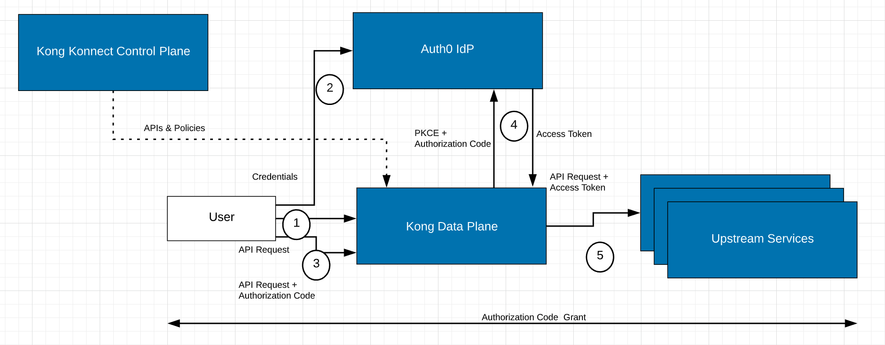
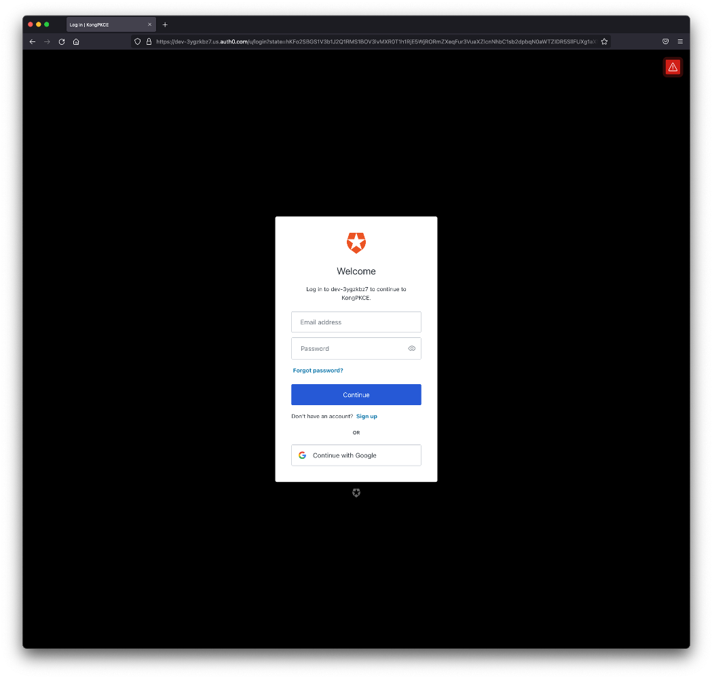
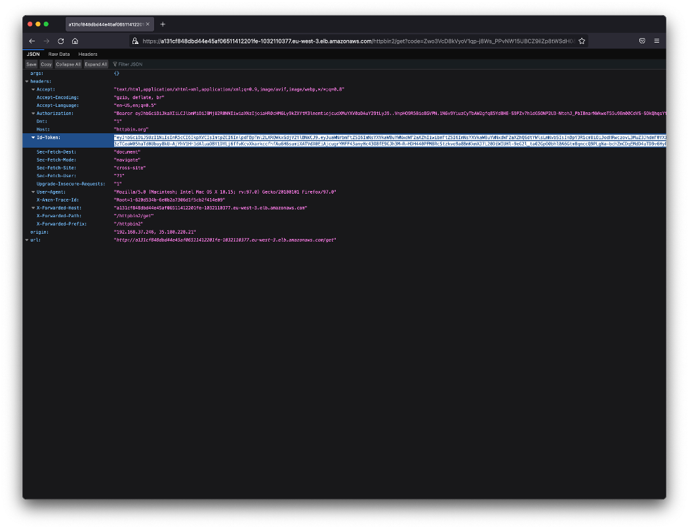
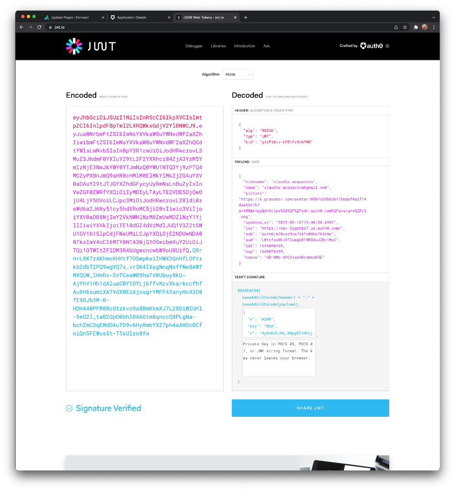

# Kong Konnect and Auth0 - Authorization Code Grant with PKCE (Proof Key for Code Exchange)

If you are building a native application, then the Authorization Code flow with a Proof Key for Code Exchange (PKCE) is the recommended method for controlling the access between your application and a resource server. The Authorization Code flow with PKCE is similar to the standard Authorization Code flow with an extra step at the beginning and an extra verification at the end. Please refer to this link to learn more about [Authorization Code with PKCE](https://auth0.com/docs/get-started/authentication-and-authorization-flow/authorization-code-flow-with-proof-key-for-code-exchange-pkce).

## The Authorization Code Grant
Here's the typical Authorization Code Flow with the extension PKCE (Proof Key for Code Exchange):

1. Consumer provides a credential to the Identity Provide (IdP). If the Consumer sends a request to the API Gateway, since it doesn't include any token, the Gateway should redirect the Consumer to the IdP, again, to provide credentials.
2. IdP takes the credential to authenticate the Consumer using specific User Databases.
3. IdP issues the Authorization Code. IdP redirects the Consumer back to the API Gateway.
4. The API Gateway connects to IdP with the Authorization Code and gets the Access Token
5. The API Gateway validates the token and passes the request to the Upstream Services.

## Kong Declaration (decK)
For this second guide, instead of the Konnect Control Plane GUI, we are going to use [decK](https://docs.konghq.com/deck) (Declarations for Kong) to manage Kong's configuration using declarations. This means that a developer can define the desired state of Kong Gateway or Konnect – services, routes, plugins, and more – and let decK handle implementation without needing to execute each step manually, as you would with the Kong Admin API.

### Create a basic Kong Route using decK
You can install deck in MacOs with brew:

<pre>
$ brew tap kong/deck
$ brew install kong/deck/deck
</pre>

To get a full dump of the Kong objects run the following command. That will create a "konnect.yaml" file with all current Kong specification:

deck konnect dump --konnect-email <konnect_id> --konnect-password '<konnect_password>'

For the simplest Kong Service and Route creation create a <b>kong.yaml</b> file with the following declaration:

<pre>
_format_version: "0.1"
service_packages:
- name: httpbinservice
  versions:
  - implementation:
      kong:
        service:
          url: http://httpbin.org
          id: 00000000-0000-0000-0000-000000000001
          retries: 5
          routes:
          - https_redirect_status_code: 426
            name: httpbinroute
            path_handling: v0
            paths:
            - /httpbin
            request_buffering: true
            response_buffering: true
            strip_path: true
          write_timeout: 60000
      type: kong-gateway
    version: v1
</pre>

Submit the declarion with:

<pre>
deck konnect sync --konnect-email <konnect_id> --konnect-password '<konnect_password>' -s kong.yaml
</pre>

### Create the same Kong Route with the Client Credential Grant

As another decK exercise, we are going to create the same Kong Objects we described in the first guide using decK.

First of all, delete the Kong Service, Route and Plugins we had created before. Then create a file name <b>kong_oidc.yaml</b> with the following declaration:

<pre>
_format_version: "0.1"
service_packages:
- name: httpbinservice
  versions:
  - implementation:
      kong:
        service:
          connect_timeout: 60000
          host: httpbin.org
          id: 00000000-0000-0000-0000-000000000000
          port: 80
          protocol: http
          read_timeout: 60000
          retries: 5
          routes:
          - https_redirect_status_code: 426
            name: httpbinroute
            path_handling: v0
            paths:
            - /httpbin
            plugins:
            - config:
                minute: 5
              enabled: true
              name: rate-limiting
            - config:
                cache_ttl: 30
                strategy: memory
              enabled: true
              name: proxy-cache
            - config:
                issuer: https://dev-xxxxxx.us.auth0.com/.well-known/openid-configuration
                scopes:
                token_post_args_names: ["audience"]
                token_post_args_values: ["https://clientcredentials.com"]
              enabled: true
              name: openid-connect
            preserve_host: false
            request_buffering: true
            response_buffering: true
            strip_path: true
          write_timeout: 60000
      type: kong-gateway
    version: v1
</pre>

* Consume the Route with Client Id and Client Secret
<pre>
http a131cf848dbd44e45af06511412201fe-1032110377.eu-west-3.elb.amazonaws.com/httpbin/get -a r7lgArWHmm3E12elLTRDPVnBHAExruEg:6F3nCynbE6Hgs9cUSWfMYvE2_urz_xPqOsAI0y6K3sob-ZT1AC_DGdn4j2pno7G_
</pre>

## Auth0 Application Creation
* Login to Auth0 console again and click on <b>Applications</b> -> <b>Applications</b> -> <b>+ Create Application</b>. Create a Native Application named <b>KongPKCE</b>.

* Click on <b>Settings</b> tab and configure the Application using the Kong Data Plane's Load Balancer. Note it's refering to new Kong Route, <b>httpbin2</b>

For "Application Login URI" type "https://a131cf848dbd44e45af06511412201fe-1032110377.eu-west-3.elb.amazonaws.com/httpbin2/get"

For "Allowed Callback URLs" type "https://a131cf848dbd44e45af06511412201fe-1032110377.eu-west-3.elb.amazonaws.com/httpbin2/get"

For "Allowed Logout URLs" type "https://a131cf848dbd44e45af06511412201fe-1032110377.eu-west-3.elb.amazonaws.com"

* Save the Client Id, we're going to use it to configure the Kong OIDC plugin. In our case, LMttfxuWLvRTCUwgkR1MFWXuJZBv1MyC

### Add a new Route to the Kong declaration with Authorization Code Grant

Modify the declaration file, adding the new Kong Route, <b>httpbin2</b>. Note that, just for this demonstration, we are going to inject the id token along with the access token in our request using the specific <b>upstream_id_token_header: id-token</b> setting. The scope has been defined as <b>[openid profile]</b> to get access to the user's information.

<pre>
_format_version: "0.1"
service_packages:
- name: httpbinservice
  versions:
  - implementation:
      kong:
        service:
          connect_timeout: 60000
          host: httpbin.org
          id: 00000000-0000-0000-0000-000000000000
          port: 80
          protocol: http
          read_timeout: 60000
          retries: 5
          routes:
          - https_redirect_status_code: 426
            name: httpbinroute
            path_handling: v0
            paths:
            - /httpbin
            plugins:
            - config:
                minute: 5
              enabled: true
              name: rate-limiting
            - config:
                cache_ttl: 30
                strategy: memory
              enabled: true
              name: proxy-cache
            - config:
                issuer: https://dev-xxxxxx.us.auth0.com/.well-known/openid-configuration
                scopes:
                token_post_args_names: ["audience"]
                token_post_args_values: ["https://clientcredentials.com"]
              enabled: true
              name: openid-connect
            preserve_host: false
            request_buffering: true
            response_buffering: true
            strip_path: true
          - https_redirect_status_code: 426
            name: httpbinroute2
            path_handling: v1
            <b>paths:
            - /httpbin2
            plugins:
            - config:
                client_id: [LMttfxuWLvRTCUwgkR1MFWXuJZBv1MyC]
                auth_methods: [authorization_code]
                issuer: https://dev-xxxxxx.us.auth0.com/.well-known/openid-configuration
                scopes: [openid profile]
                token_endpoint_auth_method: none
                upstream_id_token_header: id-token
              enabled: true
              name: openid-connect
            preserve_host: false
            request_buffering: true
            response_buffering: true
            strip_path: true
          write_timeout: 60000</b>
      type: kong-gateway
    version: v1
</pre>

### Consume the Route
Redirect your browser to: 
https://a131cf848dbd44e45af06511412201fe-1032110377.eu-west-3.elb.amazonaws.com/httpbin2/get

Accept the Digital Certificate exception. Since you don't have an Access Token, the Gateway will redirect you to Auth0 to get authenticated.

Type the credentials of an existing user or sign up for a new one. After authentication, Auth0 will redirect you back to the API Gateway with the both Access and Id Tokens injected inside the request.

Again, you can check the tokens:

